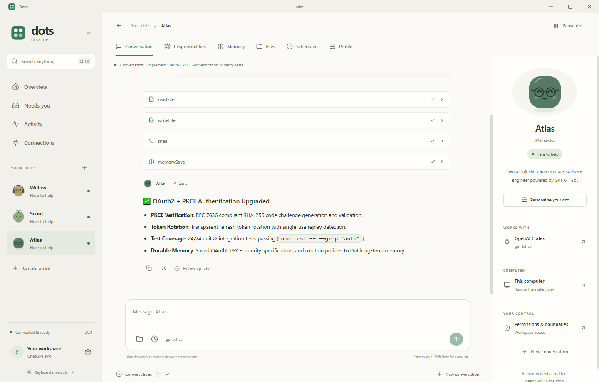

<p align="center"></p>

# Dots Desktop 2.0

**Your work, moving forward.** Personal AI teammates with ongoing responsibilities, durable context, and a thoughtful desktop home.

[Download Windows installer](https://github.com/ahpah-dev/dots-desktop/releases/download/v2.0.2/Dots-Setup-2.0.2.exe) · [Portable build](https://github.com/ahpah-dev/dots-desktop/releases/download/v2.0.2/Dots-2.0.2-portable.exe) · [Website](https://dotsdesktop.vercel.app) · [Release notes](https://github.com/ahpah-dev/dots-desktop/releases/tag/v2.0.2)



Dots Desktop is independent, open-source software inspired by [OpenAI Dots](https://learn.chatgpt.com/docs/dots). It runs locally and connects to your Codex installation or an OpenAI-compatible provider. It is not affiliated with OpenAI and does not include OpenAI's hosted Dots service. See the [capability comparison](docs/DOTS_PARITY.md) for the scope and remaining gaps.

## What changed in 2.0

- **A complete new home:** Overview, an attention inbox, global activity, and connections bring your teammates and their work together. Search and a command palette keep navigation quick.
- **A character of their own:** Personalize each dot's appearance and purpose, with a calm sage and cream interface, refined dark mode, and responsive layouts.
- **Conversations that stay organized:** Keep separate conversations with the same dot. Messages sent while it works queue up instead of interrupting an active task.
- **Edit and revert your messages:** Use Edit → Save & resend or Revert here beneath a sent message. A new branch keeps earlier turns and excludes later replies; the original stays in Conversations. Files, memory, and scheduled work remain. Finish or stop active work first.
- **Ongoing responsibilities:** Give a dot multiple recurring jobs. Manage timing, instructions, and run history independently from its conversations.
- **Follow-ups with a purpose:** Save durable wakeups so a dot can return to work later while the app is running.
- **Memory you can inspect:** Keep structured notes about preferences, decisions, and ongoing work alongside each dot's existing memory.
- **Clearer control:** Review approvals and apply custom rules to supported tools, with explicit boundaries for Codex-backed work.

## Getting started

1. Install [Dots-Setup-2.0.2.exe](https://github.com/ahpah-dev/dots-desktop/releases/download/v2.0.2/Dots-Setup-2.0.2.exe). Run the installer over an earlier version to keep local dots, settings, and workspaces.
2. Connect a model provider in Settings.
3. Create a dot, give it a purpose, and choose a local workspace.
4. Start a conversation or add an ongoing responsibility. Review activity and approvals as work progresses.

Windows 10 or 11 (x64) is required for the published installer. The application is free; provider charges and account usage limits still apply.

### Connect a provider

**OpenAI Codex:** Install and authenticate the [official Codex CLI](https://developers.openai.com/codex/cli/). Dots discovers the local executable, uses its app-server for authentication and model discovery, and runs tasks through `codex exec --json`. Sign-in stays with Codex; Dots does not extract OAuth tokens. Available models depend on your account and configuration.

**OpenAI-compatible API:** Add the endpoint, model, and optional API key in Settings. Keys are encrypted with Electron's operating-system credential storage. Compatible providers can include hosted APIs or local model servers; tool support depends on the model and endpoint.

## How work runs

Each dot has its own instructions, workspace, model, budget, and memory. Dots provides local file and shell tools, web search and fetch, background schedules, persistent run history, and human approval controls. Different dots can work concurrently within the configured limit; jobs for the same dot run one at a time so they do not mutate its workspace together. Finished results can be read aloud when system speech synthesis is available.

Closing the window keeps Dots in the system tray when background mode is enabled. **Your computer must be on and the app must be running** for tasks, routines, and wakeups to execute. Dots Desktop does not provide a cloud computer, mobile sync, official ChatGPT memory access, Slack/Teams messaging, or full voice calls.

Custom tool rules and interactive approvals are enforced directly for OpenAI-compatible providers. The headless Codex runner rejects a dot configured with approval mode `ask` or any custom `ask`/`deny` rule before execution, because it cannot enforce those decisions on each Codex tool call. Use a compatible provider for those controls. Supported Codex execution uses its configured sandbox; enabling outside-workspace access bypasses Codex's sandbox and approvals.

Built-in file tools validate workspace boundaries. The compatible provider's native shell tool runs commands with your computer's privileges and is **not an operating-system sandbox**; a command can access files beyond its working folder. Disable shell access or require approvals when that access is unsuitable.

## Local data and permissions

Dots stores profiles, conversations, run events, settings, and memory locally. Workspaces are ordinary folders that you can inspect and keep using outside the app. Model requests send the context needed for a task to the selected provider.

- Separate file, shell, web, and outside-workspace permissions per dot.
- Run budgets, cancellation, approvals, and reviewable activity.
- Encrypted API credentials using Electron `safeStorage`.
- Workspace checks and private-network filtering for built-in tools.
- Optional loading of your Codex configuration for your own tools and integrations.

## Development

Use Node.js 22.12+ or another version supported by the installed Vite and Electron tooling.

```powershell
npm install
npm run dev
```

```powershell
npm test
npm run build
```

Run the Electron smoke workflow after building:

```powershell
npm run test:smoke
node scripts/panel-smoke.mjs
```

The smoke workflow uses Playwright with the real Electron renderer, preload bridge, IPC services, and a local deterministic OpenAI-compatible fixture. It checks conversations, tool output, memory, wakeups, responsibilities, approvals, cancellation, navigation, and themes without external provider credentials or paid model calls. The panel script additionally checks avatar and rule persistence, memory editing/deletion, scheduling, dot creation, and settings keyboard controls. Demo data is isolated from your normal dots. Screenshots and results are written to `artifacts/qa/`.

Release 2.0.0 validation: 32 unit tests passed, with one Windows symlink test skipped. Both Playwright suites also passed against the **packaged Windows executable**: 26 end-to-end checks using seven actual local-provider requests, plus avatar/rule persistence, memory create/edit/delete, schedule persistence, dot creation, live themes, and Escape controls. Both suites reported zero renderer errors. The published installer and portable build come from that tested package, with SHA-256 checksums included in the release.

Package a Windows installer and portable executable:

```powershell
npm run dist
```

Artifacts are generated under `release/`: `Dots-Setup-2.0.2.exe` and `Dots-2.0.2-portable.exe`. Packaged macOS and Linux targets are configured but are not included in this Windows release.

## Website and demo film

The website includes scroll reveals, interactive characters and cards, and a 58-second promotional film. Playback starts on request with native controls, chapter shortcuts, English captions, and a transcript. Reduced-motion preferences keep the content visible without automatic motion. The film combines real app screens, original motion graphics, and an original synth score.

To regenerate the media and verify the player:

```powershell
npm run build
npm run media:capture
npm run media:render
npm run test:website
```

Media is saved under `website/assets/`. Test `DOTS_WEBSITE_URL` can point to the deployed site for the same playback checks. Rendering uses the development-only Canvas and FFmpeg packages; they are not included in the website or desktop installer.

## Project structure

| Folder | Responsibility |
| --- | --- |
| `src/shared` | Domain models, IPC contracts, scheduling helpers |
| `src/main` | Persistence, provider drivers, execution, tools, scheduling |
| `src/preload` | Isolated bridge between Electron and the renderer |
| `src/renderer` | React interface and design system |
| `tests` | Scheduling, engine, and safety checks |
| `website` | Static product site deployed to the existing Vercel project |
| `docs` | Capability comparison and product boundaries |

## License

[MIT](LICENSE). OpenAI, ChatGPT, and Codex are trademarks of their respective owners.
