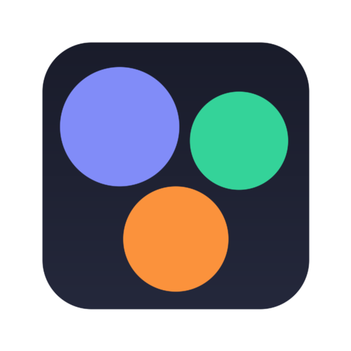
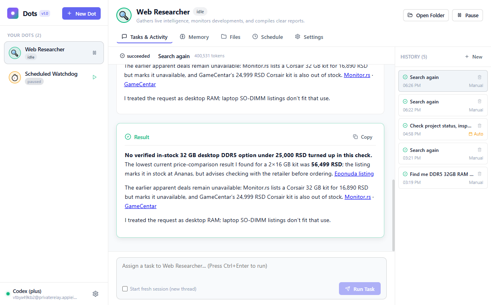

# Dots Desktop

<div align="center">
  
  <h3>Persistent, Autonomous AI Agents with Workspaces, Memory & Background Execution</h3>
  <p>Inspired by OpenAI Dots — Built for Desktop</p>
  <p>
    <a href="https://dots-desktop-seven.vercel.app"><strong>🌐 Visit Live Website</strong></a> &nbsp;|&nbsp;
    <a href="https://github.com/davidegeric-cloud/dots-desktop/releases/download/v1.0.4/Dots-Setup-1.0.4.exe"><strong>💾 Download Windows Installer (v1.0.4)</strong></a> &nbsp;|&nbsp;
    <a href="https://github.com/davidegeric-cloud/dots-desktop/releases/tag/v1.0.4"><strong>📦 Releases</strong></a>
  </p>
  <br />
  
</div>

---

## Overview

**Dots Desktop** is an easy-to-use desktop application for creating, managing, and collaborating with persistent AI agents ("Dots"). Each Dot operates as an autonomous teammate with its own isolated workspace, long-term memory, customizable instructions, tool permissions, and scheduled background routines.

Dots features first-class integration with **OpenAI Codex** through local CLI authentication, eliminating the need to manually copy API keys when already logged into a ChatGPT account. It also supports any OpenAI-compatible API endpoint (direct OpenAI API, Ollama, Groq, OpenRouter, vLLM) with credentials securely encrypted using OS keystore APIs.

---

## ✨ Key Capabilities

* **Persistent AI Agents ("Dots")**: Create multiple specialized agents (e.g. Software Engineer, Web Researcher, Automated Watchdog, Documentation Specialist). Each Dot maintains its own identity, color, emoji, and instructions.
* **Dedicated Workspaces**: Every Dot has its own folder on disk for reading, editing, and creating project files without interfering with other agents.
* **Durable Long-Term Memory**: Dots automatically summarize important project conventions, decisions, and build instructions at the end of runs, recalling them in future tasks.
* **Multi-Tool Autonomous Execution**:
  * **Shell Commands**: Execute PowerShell and shell tasks inside the Dot's workspace.
  * **File Tools**: Atomic reads, writes, edits, and fuzzy searches with strict workspace escape protection.
  * **Live Web Search & Browsing**: Keyless DuckDuckGo search, lightweight HTML extraction, and full JavaScript headless browser rendering.
  * **Memory Storage**: Direct recall and update of durable facts.
* **OpenAI Codex & Custom Providers**:
  * Automatic zero-friction connection to local **OpenAI Codex** (detects ChatGPT Plus, Pro, Team accounts).
  * 1-click official browser and device-code OAuth sign-in.
  * Custom OpenAI-compatible endpoints with local OS-level encryption for keys.
* **Background & Scheduled Execution**:
  * Run tasks on fixed intervals (e.g. every 30 minutes), daily times (e.g. weekdays at 09:00), or standard cron expressions.
  * Keeps running seamlessly when minimized to the system tray.
  * Sleep-drift resilient scheduling: overdue tasks fire cleanly after system wake.
* **Security & Guardrails**:
  * Workspace sandboxing with path traversal and symlink escape prevention.
  * SSRF & private IP blocker preventing access to local network hosts (127.0.0.1, 10.x, 192.168.x, link-local).
  * Human approval gate for sensitive shell or file modifications.
  * Never extracts or exposes credentials in plaintext.

---

## 🛠️ Architecture

```
dots-desktop/
├── src/
│   ├── shared/                # Pure types, IPC contracts, and schedule engine
│   │   ├── types.ts           # Domain models: Dots, Runs, Providers, Approvals
│   │   ├── api.ts             # Typed IPC interface between main & renderer
│   │   └── schedule.ts        # Cron, interval, and daily schedule calculations
│   ├── main/                  # Electron main process & backend services
│   │   ├── engine/            # Run manager, scheduler, context builder, approval gate
│   │   ├── providers/         # Codex CLI driver & OpenAI Chat Completions engine
│   │   ├── storage/           # Encrypted credential store, dots, runs, settings
│   │   ├── tools/             # File, shell, web search, web fetch, browser, memory
│   │   └── services.ts        # Unified service composition layer
│   ├── preload/               # Context bridge exposing window.dots
│   └── renderer/              # Modern React 19 UI
│       ├── components/        # Sidebar, DotView, RunTimeline, Memory, Files, Schedule, Settings
│       ├── context/           # AppContext with reactive push events
│       └── index.css          # Design system & responsive layout
└── tests/                     # Vitest test suite for scheduler, engine, and network safety
```

---

## 🚀 Getting Started

### Prerequisites

* Node.js v20+ or v22+
* (Optional) [OpenAI Codex CLI](https://developers.openai.com/codex/) installed and authenticated (`codex login`)

### Development

```bash
# Clone the repository
git clone https://github.com/davidegeric-cloud/dots-desktop.git
cd dots-desktop

# Install dependencies
npm install

# Run unit tests
npm test

# Start the app in development mode (Vite + Electron)
npm run dev
```

### Production Build & Installer

```bash
# Typecheck and compile main + renderer bundles
npm run build

# Package into a standalone Windows NSIS installer
npm run dist
```

The resulting standalone installer will be located in `release/Dots Setup 1.0.0.exe`.

---

## 🔒 Security & Privacy

1. **Zero Credential Extraction**: When using OpenAI Codex, Dots communicates with the local CLI process via official JSON-RPC without reading or extracting stored OAuth tokens.
2. **Encrypted Storage**: External provider API keys are encrypted at rest using Electron `safeStorage` (Windows DPAPI, macOS Keychain, Linux libsecret).
3. **SSRF Guard**: Web browsing and fetch tools validate domain resolutions against private and link-local IP ranges before connecting.
4. **Sandboxed Workspaces**: Agents are restricted to their assigned workspace directories unless explicitly granted outside-workspace permissions by the user.

---

## License

MIT © Dots
